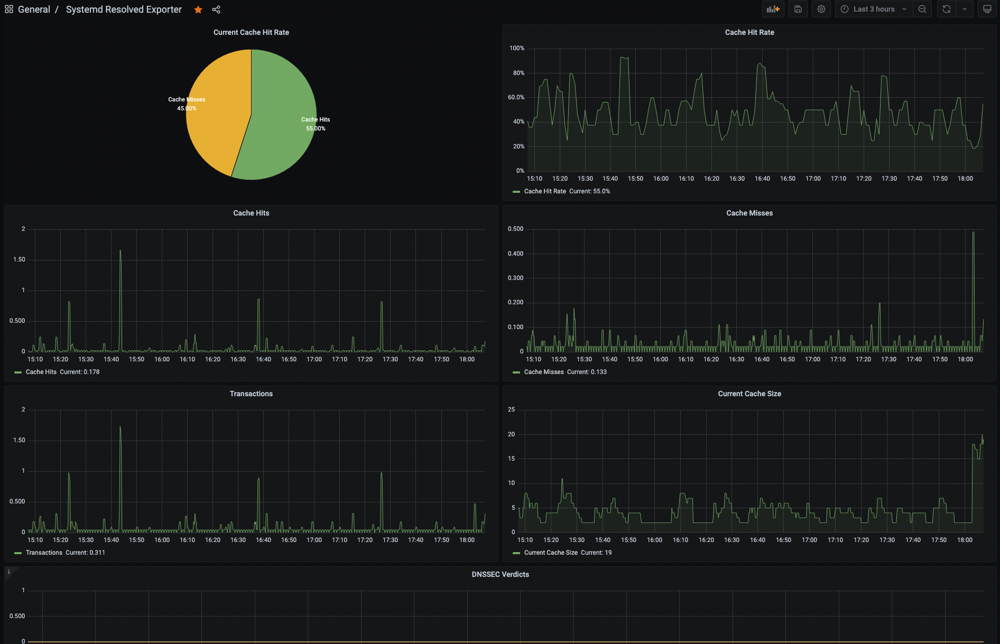

Systemd Resolved Exporter
---

Systemd Resolved Exporter exports systemd-resolved metrics provided by `systemd-resolve --statistics` command

# usage

```
usage: systemd_resolved_exporter [<flags>]

Flags:
  -h, --help                    Show context-sensitive help (also try --help-long and --help-man).
      --listen-address=":9924"  The address to listen on for HTTP requests.
      --debug                   Debug mode.
      --gather-dnssec           Collect DNSSEC statistics.
```

# sample output

```
$ curl -s  http://localhost:9924/metrics|egrep -v "go_|process|http"
# HELP systemd_resolved_cache_hits_total Total Cache Hits
# TYPE systemd_resolved_cache_hits_total counter
systemd_resolved_cache_hits_total 914
# HELP systemd_resolved_cache_misses_total Total Cache Misses
# TYPE systemd_resolved_cache_misses_total counter
systemd_resolved_cache_misses_total 640
# HELP systemd_resolved_current_cache_size Current Cache Size
# TYPE systemd_resolved_current_cache_size gauge
systemd_resolved_current_cache_size 6
# HELP systemd_resolved_current_transactions Current Transactions
# TYPE systemd_resolved_current_transactions gauge
systemd_resolved_current_transactions 0
# HELP systemd_resolved_dnssec_bogus_total Total number of DNSSEC Verdicts Bogus
# TYPE systemd_resolved_dnssec_bogus_total counter
systemd_resolved_dnssec_bogus_total 0
# HELP systemd_resolved_dnssec_indeterminate_total Total number of DNSSEC Verdicts Indeterminate
# TYPE systemd_resolved_dnssec_indeterminate_total counter
systemd_resolved_dnssec_indeterminate_total 0
# HELP systemd_resolved_dnssec_insecure_total Total number of DNSSEC Verdicts Insecure
# TYPE systemd_resolved_dnssec_insecure_total counter
systemd_resolved_dnssec_insecure_total 3
# HELP systemd_resolved_dnssec_secure_total Total number of DNSSEC Verdicts Secure
# TYPE systemd_resolved_dnssec_secure_total counter
systemd_resolved_dnssec_secure_total 0
# HELP systemd_resolved_transactions_total Total Transactions
# TYPE systemd_resolved_transactions_total counter
systemd_resolved_transactions_total 1513
```


# grafana dashboard sample

- https://grafana.com/grafana/dashboards/15816

